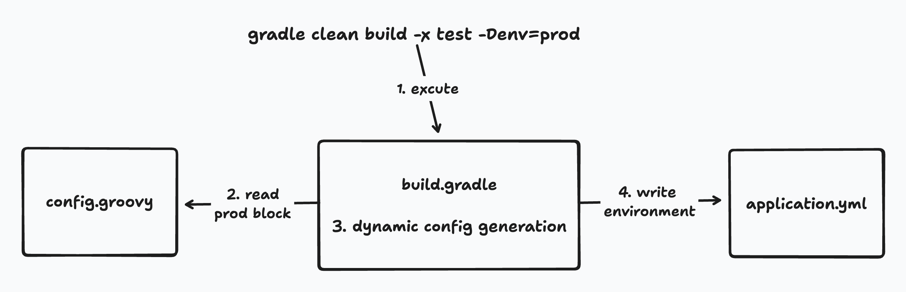

# 多环境说明


在项目开发中一般都会区分开发环境 dev, 生产环境 prod，
常用的使用方式是使用每个环境一个对应的 yml 文件的方式，如下所示

```shell
├── application.yml
├── application-dev.yml
├── application-prod.yml
```
Passiflora 没有采用这种方式，原因是：
1. 多 yml 的方式不便于 gradle 脚本读取。
比如数据库配置，项目启动需要用到；liquibase 的配置在 build.gradle 中也需要使用。
2. 有些 yml 中的配置，比如系统版本，当前环境，需要在编译的过程中，由编译程序填充到 yml 中。

主要基于以上两点，所以 Passiflora 将所有的连接配置，写在了 [config.groovy](..%2F..%2Fpassiflora-server%2Fconfig.groovy) 文件中，
并会在编译过程中动态生成一些配置，比如当前环境，系统版本，会将其动态填充到编译结果中的 yml 中，来进行多环境的实现。



### 使用对应环境编译的方法
```shell
# 本地环境
gradle clean build -x test
# 默认使用的 local 环境，所以上述命令等同于
gradle clean build -x test -Denv=local

# 生产环境
gradle clean build -x test -Denv=prod
```

### FAQ
1. 如果项目在启动过程中，因 yml 中存在 @xxx@ 这种没有被替换的占位标志
   1. 多出现在使用 IDE 直接运行项目的情况，重新执行对应的编译指令再运行即可
   2. 检查 [config.groovy](..%2F..%2Fpassiflora-server%2Fconfig.groovy) 是否确实没有对应环境的对应配置
