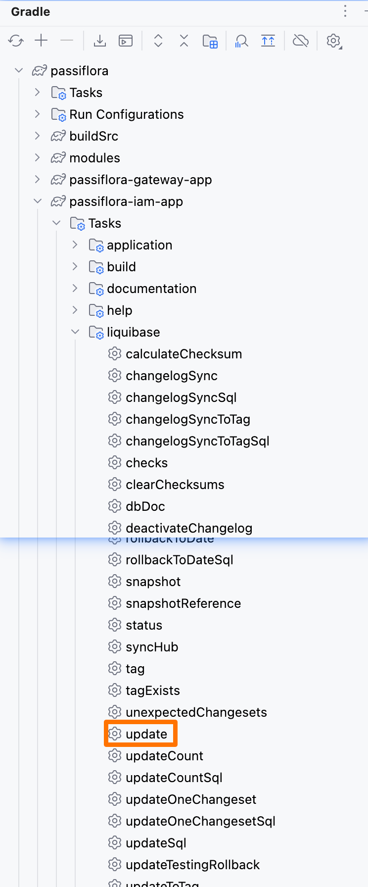

# 本地环境搭建

JDK 版本：21

将下列配置添加到 hosts 中，Windows 中 hosts 在 `C:\Windows\System32\drivers\etc` 目录下，Mac 中 hosts 在 `/etc` 目录下
```shell
# Passiflora Cloud
127.0.0.1 passiflora-postgres
127.0.0.1 passiflora-redis
127.0.0.1 passiflora-oss
127.0.0.1 passiflora-nacos
```

### 数据库初始化
1. 创建 passiflora_iam，passiflora_storage 库
2. 修改 config.yml 中的数据库配置
3. 使用 IDEA 右侧 gradle 面板，分别点击 passiflora-iam-app 和 passiflora-storage-app 的 liquibase 的 update task
   
4. 数据库就初始化完成了

# 本地运行中间件
### minio
```shell
docker run -d --name minio \
    --restart=unless-stopped \
    -p 9000:9000 \
    -p 9001:9001 \
    -e MINIO_ROOT_USER="minio" \
    -e MINIO_ROOT_PASSWORD="password" \
    -v /etc/localtime:/etc/localtime:ro \
    -e TZ="Asia/Shanghai" \
    bitnami/minio:2024.10.13
```

### redis
```shell
docker run -d \
    --restart=unless-stopped \
    --name redis \
    -p 6379:6379 \
    -v /etc/localtime:/etc/localtime:ro \
    -e TZ="Asia/Shanghai" \
    redis:7.4.1-alpine
```

### nacos
```shell
## 建议使用资源占用更低的 r-nacos
## http://localhost:10848/rnacos/
## admin/admin
docker run -d \
    --name r-nacos \
    --restart=unless-stopped \
    -p 8848:8848 -p 9848:9848 -p 10848:10848 \
    -v /etc/localtime:/etc/localtime:ro \
    -e TZ="Asia/Shanghai" \
    qingpan/rnacos:v0.6.3-alpine

## 官方 nacos
docker run -d --name nacos \
   --restart=unless-stopped \
   -p 8848:8848 \
   -p 9848:9848 \
   -p 9849:9849 \
   -e MODE=standalone \
   -e EMBEDDED_STORAGE \
   -v /etc/localtime:/etc/localtime:ro \
   -e TZ="Asia/Shanghai" \
   nacos/nacos-server:v2.4.3-slim
```

### postgres
```shell
docker run --name postgres \
    --restart=unless-stopped \
    -e POSTGRES_PASSWORD=postgres \
    -p 5432:5432 \
    -v $HOME/workspace/docker-data/postgres/data:/var/lib/postgresql/data \
    -v $HOME/workspace/docker-data/postgres/log:/var/log/postgresql \
    -v $HOME/workspace/docker-data/postgres/config:/etc/postgresql \
    -v /etc/localtime:/etc/localtime:ro \
    -e TZ="Asia/Shanghai" \
    -d postgres:17.2-bookworm
```