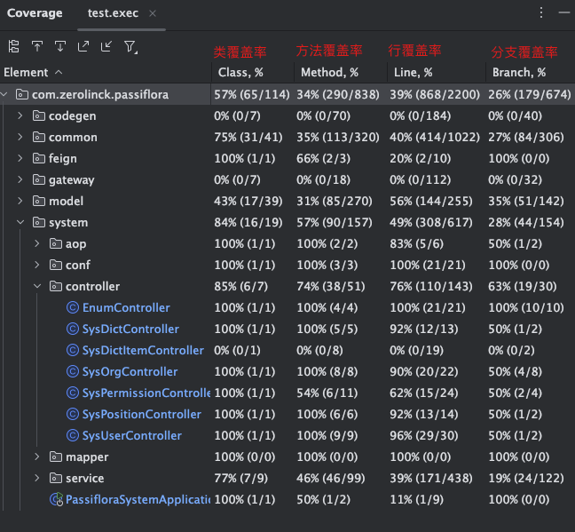

# 集成测试说明
Passiflora 使用 Junit 对接口进行集成测试，
并使用 Jcoco 生成单元测试报告。
执行 `gradle build` 会自动执行测试（`gradle test`）。

单元测试执行完成会在 build/reports/tests/test 目录下生成网页的测试报告，
打开此目录下 index.html 可进行查看。

单元测试执行完成会在 build/jacoco 目录下生成 exec 格式的测试覆盖率报告，
下面会介绍查看方法。

### 使用 IDEA 查看测试覆盖率
1. 点击 IDEA顶部标签栏中的Run
2. 选择 Show Coverage Data/Manage Coverage Reports
3. 单击 + 号选择 build/jacoco 文件夹中的 exec 文件
4. 确认后，勾选刚刚导入进来的文件，选择Show Selected即可

